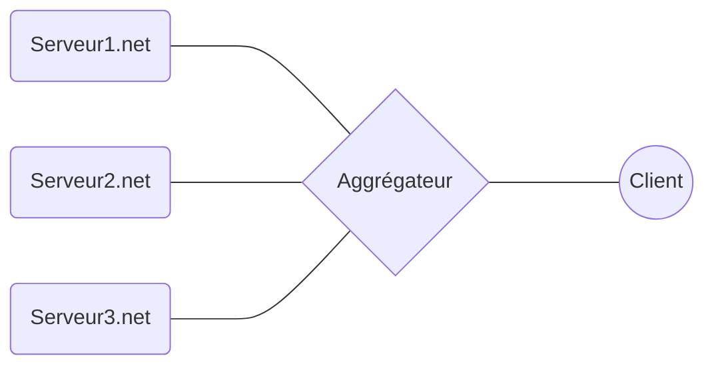

# Python SAE203
### Mettre en place une solution informatique dans le bute de centraliser les flux RSS de plusieurs machines par le biais d'une machine agrégateur.

-----

## Installer la solution sur votre agrégateur

Votre machine doit avoir la dernière version de **Python** et d'**Apache** d'installé.
Cloner le git dans un dossier:

    git clone https://github.com/guedesite/python-sae203.git

Installer les dépendances pour **Python** avec **pip**:

    pip install feedparser
    pip install pyyaml

## Fonctionnalités

 - Simple d'utilisation et de configuration
 - Ultra léger
 - Simple d'édition
 - Puissant, jusqu'à une centaine de machine en simultané 

## Configuration de l'agrégateur: 
Le fichier de configuration [assets/config.yaml](assets/config.yaml) se compose que ceci par default:

    sources:
     - http://serveur1.net
     - http://serveur2.net
     - http://serveur3.net
    rss-name: rss.xml
    destination: /var/www/html/index.html
    tri-chrono: true

|Nom| Description | Type | Valeur possible |
|---|----|--|----|
| sources | Url des serveurs produisant des flux RSS |**list** | [http://serveur1.net, http://serveur2.net, ...] | 
| rss-name | Nom du fichier RSS produit par les serveurs | **String** | rss.xml, flux.xml ...|
| destination | fichier ou la page HTML sera généré | **String** | index.html, /var/www/html/index.html, html/index.html ...
| tri-chrono | Génère oui ou non la page HTML en rangeant chronologiquement les flux RSS en commençant par les plus récents au plus anciens | **Boolean**   | true, false

Avec le fichier de configuration par default, le script [aggreg.py](aggreg.py) génère la page HTML en récupérant les flux RSS des URLS:

 - http://serveur1.net/rss.xml
 - http://serveur2.net/rss.xml
 - http://serveur3.net/rss.xml

Génère la page HTML dans le dossier **/var/www/html** en rangeant dans le temps les flux par ordre décroissant.

## Mettre en place un tâche Cron sur votre agrégateur pour  l'automatisation de la génération de la page HTML

Dans cette exemple, nous voulons que la page internet soit généré toutes les heures:

En premier, autorisons l'éxecution du script:

    chmod a+x aggreg.py

Ouvrez l'éditeur de **Crontab**:

    crontab -e
Une fois sur l'éditeur:

    ...
    0 * * * * /usr/bin/python /path/to/git/aggreg.py

## Éditer la page HTML et le CSS

#### Édition du la page HTML
Le modal de la page HTML se trouve dans [assets/model.html](assets/model.html), tout son contenue est éditable et sauf les balise entre **{** et  **}**, elles font référence à des valeurs dans le flux RSS et peuvent être seulement supprimer ou déplacer. Sauf exception de la balise **{boucle}**, c'est le cœur de la génération de la page html, il doit être présent obligatoirement et représente le début et la fin du contenue HTML à répété pour l'affichage de chaque entrée dans les flux RSS.

#### Édition du CSS
L'édition du CSS se fait obligatoirement depuis le fichier [assets/theme.css](assets/theme.css) et surtout pas directement la ou la page à été généré, puisqu'à la prochaine génération, le fichier CSS sera remplacer si il détecte un changement entre le fichier de base et celui généré avec la page HTML.

## Format du flux RSS

Le flux RSS doit respecté les spécificité de RSS 2.0 et doit être construit comme cela:

    <?xml version="1.0" encoding="UTF-8"?>
	<rss version="2.0">
		<channel>
		    <title>Mon site</title>
		    <description>Ceci est un exemple de flux RSS 2.0</description>
		    <lastBuildDate>Sat, 07 Sep 2002 00:00:01 GMT</lastBuildDate>
		    <link>http://www.example.org</link>
		    <item>
		      <title>Actualité N°1</title>
		      <description>Ceci est ma première actualité</description>
		      <pubDate>Sat, 07 Sep 2002 00:00:01 GMT</pubDate>
		      <link>http://www.example.org/actu1</link>
		    </item>
		    <item>
		      <title>Actualité N°2</title>
		      <description>Ceci est ma seconde actualité</description>
		      <pubDate>Sat, 07 Sep 2002 00:00:01 GMT</pubDate>
		      <link>http://www.example.org/actu2</link>
		    </item>
		    ...
		 </channel>
	</rss>
